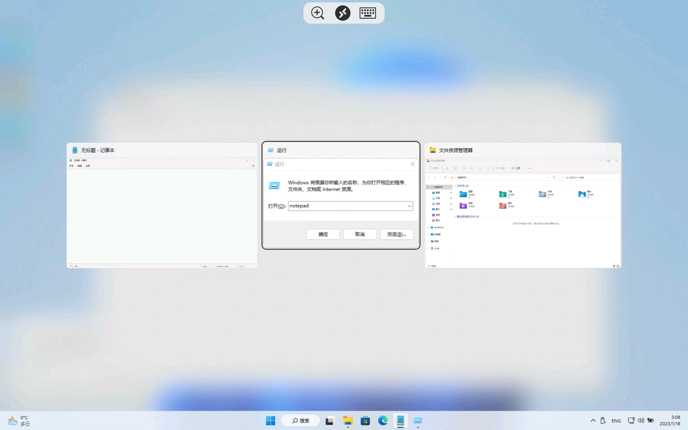
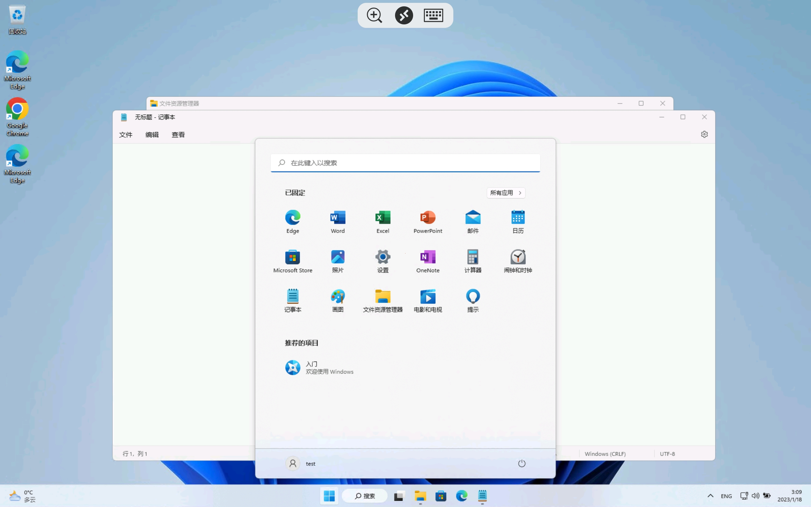

# MiuiPadMeta

为小米平板5系列恢复键盘Meta/Win键功能，同时禁用Alt-Tab快捷键，适配了Android11-13的MIUI

Restore Meta/Win key function on Mi Pad 5 series, and disable Alt-Tab hotkey, adapted for Android 11-13 MIUI


MIUI Android11: PC模式下的快捷键依旧可用，PC模式的快捷键是另一套逻辑实现


### 系统版本支持情况 OS version support

| 系统版本           | 恢复Meta键 | 禁用Alt-Tab |
| ------------------ | ---------- | ----------- |
| MIUI12.5 Android11 | ?          | ?           |
| MIUI13 Android11   | √          | √           |
| MIUI13 Android12   | ?          | ?           |
| MIUI14 Android13   | ?          | √           |
| 非MIUI系统         | N/A        | ? *         |

√ 表示经过测试，目前支持

? 表示没有经过测试，可能支持

× 表示经过测试，目前不支持

> *禁用Alt-Tab理论上在所有Android系统上支持。


### 鸣谢 Special thanks

[MiuiPadESC](https://github.com/YifePlayte/MiuiPadESC) 配合此模块可以恢复ESC和禁用Win-D快捷键，实现远程桌面下全部键位可用


### 实现方法 Implementation detail

#### Android11

1. 让`com.android.server.policy.MiuiKeyShortcutManager.getEnableKsFeature`固定返回false，MIUI的快捷键就不会使能
   （或：`setprop persist.sys.enable_custom_shortcut_user 0`）

   实现方法：hook `com.android.server.policy.MiuiKeyShortcutManager.getEnableKsFeature` 固定返回false

2. 让`com.android.server.policy.PhoneWindowManager.interceptKeyBeforeDispatching` 不拦截meta key 就是包名为com.ss.android.lark.kami时的效果（MIUI给自家app开后门，只有自家app运行时不拦截meta key 其他app都拦截）

   实现方法：自定义类重写List的contains方法 替换掉`static List<String> sDeliveMetaKeyAppList`

3. 修改逻辑禁用安卓自带的alt-tab

   实现方法：hook `com.android.server.policy.PhoneWindowManager.interceptKeyBeforeDispatching` 如果是Alt-Tab则不继续运行

#### Android12

1. 同Android11 （但是这个类不在services.jar里在miui-services.jar里）

2. Android11的方法里的List被改成了 `com.android.server.policy.PhoneWindowManagerStubImpl`里的`private static final List<String> DELIVE_META_APPS` 但是他是final的改不了

   实现方法：有这个函数

   ```java
       public boolean interceptKeyWithMeta() {
           WindowManagerPolicy.WindowState windowState = this.mFocusedWindow;
           return windowState == null || !DELIVE_META_APPS.contains(windowState.getOwningPackage());
       }
   ```

   直接hook这个函数固定返回false就行

3. 同Android11

#### Android13

1. 同Android12（但是这个miui-services.jar不在system/framework里而在system_ext.img/framework里）
2. 同Android12
3. 同Android11


### 截图 Screenshot


